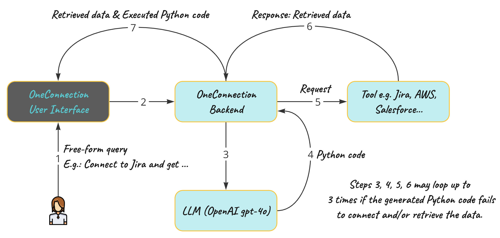

# OneConnection

This application processes free-form user queries and uses a Large Language Model (LLM) to dynamically generate Python code that connects to a specified tool and extracts user-requested data. It features a JavaScript-based frontend and a Python backend built with Flask.

<b>Example free-form request:</b> Connect to AWS and get my billing statement for November 2024.

If you have any questions or would like to collaborate, feel free to reach out to me on [LinkedIn](https://www.linkedin.com/in/jenya-stoeva-60477249/). You're more than welcome!

## Key Features

### Dynamic Code Generation
The application forwards user input to an LLM, which generates Python code to handle data extraction tasks.

### Iterative Debugging
The application executes the generated code and retrieves the requested data. The result is displayed in the frontend UI for the user.
The execution output is stored in a response_variable for debugging and further refinement.

### Error Handling and Code Refinement
If the code fails to execute (e.g., due to errors), the application sends the user input, generated code, and execution response back to the LLM.
The LLM analyzes the errors and attempts to fix the code. This process is repeated up to 3 times and stops earlier if a working solution is produced before the 3rd attempt.
This approach ensures robust, adaptive handling of user queries, leveraging the LLM’s reasoning capabilities to improve code accuracy and execution success.



## Intallation Guide

```
ONECONNECTION
│
├── Public
│   ├── index.html
│   ├── style.css
│
├── backend
│   ├── app.py                     # Main Flask app for handling requests from the frontend
│   ├── executor.py                # Module to execute Python code and handle retries
│   ├── chat_helpers.py            # Helper functions for interacting with the Large Langiage Model (LLM) 
│   ├── templates.py               # Template strings for prompt templates
│   ├── utils.py                   # Utility functions (e.g., extract Python code)
│   └── requirements.txt           # Dependencies for the backend
│
└── oneConnection.env              # Environment variables file
```

Follow the steps below to set up and run the OneConnection application on your local environment.

<b>Prerequisites</b>
Before installing, ensure you have the following:

* <b>At least Python 3.8+</b> installed on your system.
* <b>Access to a Large Language Model API</b> for generating Python code.
* A package manager like pip for Python dependencies.
* <b>Brew</b> (if you are on macOS) for managing system dependencies.

### Step 1: Clone the Repository

Clone this repository to your local machine
<code>
git clone <REPOSITORY_URL>
cd <PROJECT_FOLDER>
</code>

### Step 2: Backend Setup (Flask Application)

<b>1. Update System Packages (macOS-specific)</b><br>
If you are on macOS, update brew and ensure Python and OpenSSL are correctly installed:
<code>
brew update
brew install openssl
brew reinstall python
</code>

<b>2. Create a Virtual Environment</b><br>
Navigate to the project <b>backend</b> folder and create a virtual environment:
<code>
cd backend
python3 -m venv venv
</code>

<b>3. Activate the Virtual Environment</b><br>
Activate the virtual environment:
* On macOS/Linux
    <code>
    source venv/bin/activate
    </code>
* On Windows (Command Prompt)
    <code>
    venv\Scripts\activate
    </code>

<b>4. Install Backend Dependencies</b><br>
Install the required dependencies listed in <b>requirements.txt</b>
<code>
pip install -r requirements.txt
</code>

<b>5. Configure Environment Variables</b><br>
This is a crucial step: you need to define all variables required for the OneConnection application to successfully execute the generated Python code and connect to the respective tool. Ensure all API keys and other necessary variables related to the tool - you are attempting to connect to, are included in the <code>env</code> file so they can be properly mapped and utilized in your Python code.
Create <code>oneConnection.env</code> in your root project folder and add your variables (e.g., OPENAI_API_KEY, AWS_SECRET_ACCESS_KEY, ...).

<b>6. Set-up Large Language Model Connection</b><br>
OneConnection currently supports connectivity with OpenAI models, but you can easily add support for other models. The LLM in use is configured in <code>chat_helpers.py</code>. There are helper functions (currently commented out) that you can use to test your LLM connection. Simply uncomment them to test and ensure your LLM setup is working correctly. An additional button will appear in the User Interface.

* <b>index.html</b> Uncomment the button "Test OpenAI" and the event listener "testOpenAI".
* <b>app.py</b> No changes required, <code>/test_openai</code> passes forward to <code>executor.py</code>.
* <b>executor.py</b> No changes required, <code>test_completion</code> calls <code>test_openai_connection</code> in <code>chat_helpers.py</code>.
* <b>chat_helpers.py</b> No changes required, <code>test_openai_connection</code> passes the prompt to the model and returns its reposne. 

### Step 3: Frontend Setup (HTML/CSS)

The static frontend files are located in the <code>Public</code> folder:

* index.html: The main UI.
* style.css: Contains all styles for the application.

There is no need for additional setup for the frontend unless you would like to change something or add new functionality.

### Step 4: Run the Application

<b>1. Start the Backend</b><br>
Run the Flask application from the <code>backend</code> folder!
<code>
python3 app.py
</code>

Alternatively, you can use:
<code>
python app.py
</code>

<b>2. Access the Application</b><br>
Once the backend starts, you can access the application at the port configured in <b>app.py</b> e.g. if:
<code>
if __name__ == '__main__':
    app.run(host='0.0.0.0', port=3001)
</code>

then you application is available at:
<code>
http://localhost:3001/
</code>


